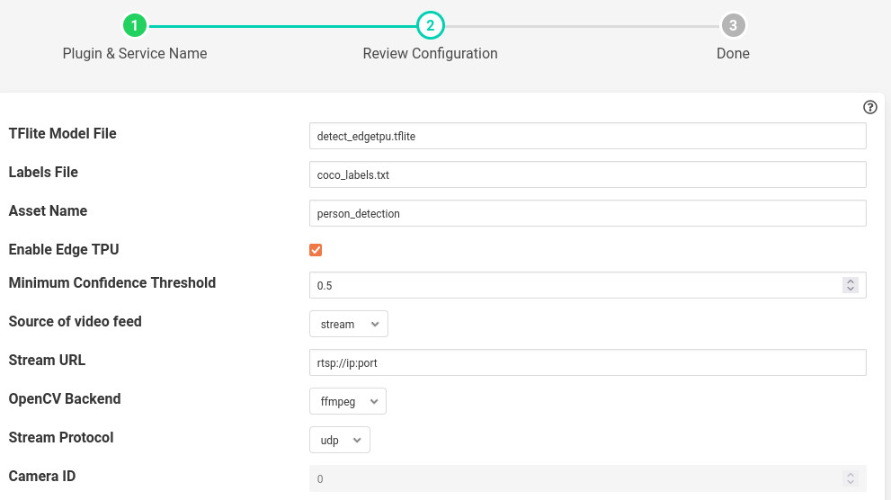
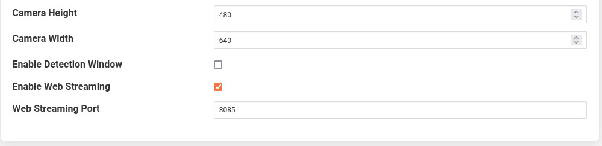

Person Detection Plugin
=======================

The *fledge-south-person-detection* detects a person on a live video feed from either a camera or on a network
stream. It uses Google's Mobilenet SSD v2 to detect a person. The bounding boxes and confidence scores are displayed on the same video frame itself.
Also FPS (frames per second) are also displayed on the same frame. The detection results are also converted into readings. The readings have mainly three things:

1. *Count* : The number of people detected.

2. *Coordinates* : It consists of coordinates (x,y) of top-left and bottom right corners of bounding box for each detected person.

3. *Confidence* : Confidence with which the model detected each person.

|config1|

  - **TFlite Model File**:
                            This is the name of the tflite model file that should be placed in
                            python/fledge/plugins/south/person_detection/model directory.
                            Its default value is detect_edgetpu.tflite.
                            If a Coral Edge TPU is not being used, the file name will be different (i.e. detect.tflite).

  - **Labels File**:
                            This is the name of the labels file that was used when training the above
                            model, this file should also be placed in same directory as the model.

  - **Asset Name**:
                           The name of the asset used for the readings generated by this plugin.

  - **Enable Edge TPU**:
                           Indicates whether to use edge TPU for inference.
                           If you don't want to use Coral Edge TPU then disable this configuration parameter.
                           Also ensure to change the name of the model file to detect.tflite if disabled.
                           Default is set to enabled.

  - **Minimum Confidence Threshold**:
                           The detection results from the model will be filtered out, if the score is below this value.

  - **Source**:
                          Either use a stream over a network or use a local camera device.
                          Default is set to stream.

  - **Streaming URL**:
                         The URL of the RTSP stream, if stream is to be used. Only RTSP streams are supported for now.

  - **OpenCV Backend**:
                         The backend required by OpenCV to process the stream, if stream is to be used.
                         Default is set to ffmpeg.

  - **Streaming Protocol**:
                         The protocol over which live frames are being transported over the network, if stream is to be used.
                         Default is set to udp.

  - **Camera ID**:
                        The number associated with your video device. See /dev in your filesystem you will see video0 or video1.
                        It is required when source is set to camera.
                        Default is set to 0.

|config2|

  - **Camera Height**:
                        The height of the canvas in which frame is to be displayed. Bounding box will be adjusted to
                        this camera height. Default is 480.
  - **Camera Width**:
                        The width of the canvas in which frame is to be displayed. Bounding box will be adjusted to
                        this camera width. Default is 640.

  - **Enable Detection Window**:
                        Show detection results in a native window.
                        Default is set to disabled.

  - **Enable Web Streaming**:
                       Whether to stream the detected results in a browser or not.
                       Default is set to enabled.

  - **Web Streaming Port**:
                      Port number where web streaming server should run, if web streaming is enabled.
                      Default is set to 8085.

Installation
------------

1. First run requirements.sh

There are two ways to get the video feed.

    1. Camera
        To see the supported configuration of the camera run the following command.
            .. code-block:: console

              $ v4l2-ctl --list-formats-ext --device /dev/video0
              You will see something like
              'YUYV' (YUYV 4:2:2)
                Size: Discrete 640x480
                        Interval: Discrete 0.033s (30.000 fps)
                Size: Discrete 720x480
                        Interval: Discrete 0.033s (30.000 fps)
                Size: Discrete 1280x720
                        Interval: Discrete 0.033s (30.000 fps)
                Size: Discrete 1920x1080
                        Interval: Discrete 0.067s (15.000 fps)
                        Interval: Discrete 0.033s (30.000 fps)
                Size: Discrete 2592x1944
                        Interval: Discrete 0.067s (15.000 fps)
                Size: Discrete 0x0

        Above example uses Camera ID 0 to indicate use of /dev/video0 device, please use the applicable value for your setup

    2. Network RTSP stream

        To create a network stream follow the following steps

        1.  Install vlc

        .. code-block:: console

              $ sudo add-apt-repository ppa:videolan/master-daily
              $ sudo apt update
              $ apt show vlc
              $ sudo apt install vlc qtwayland5
              $ sudo apt install libavcodec-extra

        2. Download some sample files from here.

        .. code-block:: console

            $ git clone https://github.com/intel-iot-devkit/sample-videos.git

        3. Either stream a file using the following

        .. code-block:: console

            $ vlc <name_of_file>.mp4  --sout '#gather:transcode{vcodec=h264,vb=512,scale=Auto,width=640,height=480,acodec=none,scodec=none}:rtp{sdp=rtsp://<ip_of_machine_steaming>:8554/clip}' --no-sout-all --sout-keep --loop --no-sout-audio --sout-x264-profile=baseline

        Note :  fill the <ip_of_the_machine> with ip of the machine which will be used to stream video. Also fill <name_of_file> with the name of mp4 file.

        4. You can also stream from a camera using the following

        .. code-block:: console

          $ vlc v4l2:///dev/video<index_of_video_device>  --sout '#gather:transcode{vcodec=h264,vb=512,scale=Auto,width=<supported_width_of_camera_image>,height=<supported_height_of_camera_image>,acodec=none,scodec=none}:rtp{sdp=rtsp://<ip_of_the_machine>:8554/clip}' --no-sout-all --sout-keep  --no-sout-audio --sout-x264-profile=baseline

        Fill the following :

        <index_of_video_device> The index with which you ran the v4l2 command mentioned above. for example video0.

        <supported_height_of_camera_image> Height you get when you ran v4l2 command mentioned above. For example Discrete 640x480.  Here 480 is height.

        <supported_width_of_camera_image> Width you get when you ran v4l2 command mentioned above. For example Discrete 640x480.  Here 640 is width.

        <ip_of_the_machine>   ip of the machine which will be used to stream video.

Once you have run the plugin by filling appropriate parameters Now go to your browser
and enter  *ip_where_fledge_is_running:the_port_for_web_streaming*
